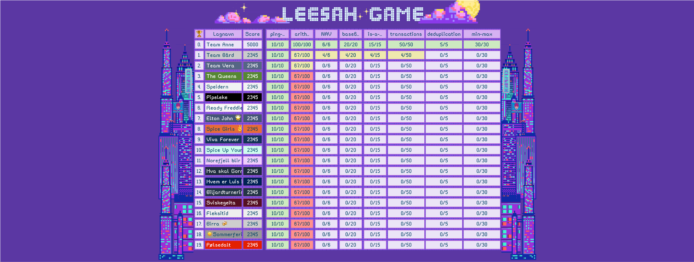

# Livet er en strøm av ~~hendelser~~ oppgaver!

## Om

Leesah-game er et hendelsedrevet applikasjonsutviklingspill som utfordrer spillerne til å bygge en hendelsedrevet applikasjon. Applikasjonen 
håndterer forskjellige typer oppgaver som den mottar som hendelser på en Kafka-basert hendelsestrøm. Oppgavene varierer 
fra veldig enkle til mer komplekse.

NAV bygger i stor grad alle nye systemer som hendelsedrevet og formålet med leesah-game er at spillerne skal få en bedre 
forståelse for hvordan man bygger slike hendelsedrevne applikasjoner. Man får også et innblikk i fordeler og ulemper med 
slike systemer. Dessuten er det innmari moro!

Lykke til!

## Dokumentasjon om oppgavene

**Start her**

- Python 🐍
  - [Oppsett og Installasjon](oppsett)
  - [Hvordan spille](hvordan-spille-spillet)

Oppgavene du kan møte i Leesah-game er som følger, og de kommer ikke nødvendigvis i rekkefølgen til listen.

- [team-registration](oppgaver/team-registration) (Første oppgaven som alltid må gjøres før man kan løse andre oppgaver)
- [ping-pong](oppgaver/ping-pong)
- [arithmetic](oppgaver/arithmetic)
- [NAV](oppgaver/nav)
- [base64](oppgaver/base64)
- [is-a-prime](oppgaver/is-a-prime)
- [transactions](oppgaver/transactions)
- [deduplication](oppgaver/deduplication)

