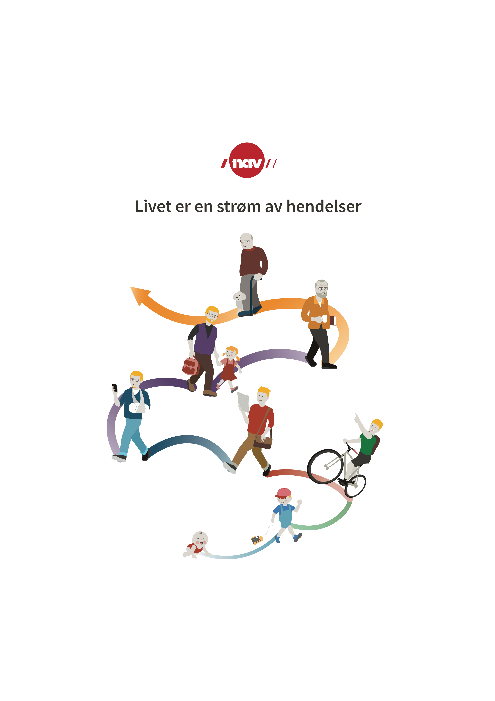

# Livet er en strøm av ~~hendelser~~ oppgaver!

## Om

Leesah-game er et hedelsedrevet applikasjonsutviklingspill som utforder spillerene til å bygge en applikasjon som håndter
forskjellige typer oppgaver som applikasjonen mottar som hendelser på en hendelsestrøm. Oppgavene varierer fra veldig enkle
til mer komplekse oppgaver. 

NAV sin teknologi-strategi, kalt "teknisk rettning", har landet på at vi i større grad skal bygge hendelsedrevne systemer.
Formålet med leesah-game er for at spillerene skal få en bedre forstålse for hvordan man bygger hendelsedrevne applikasjoner,
og fordelene og utfordringene med en slik system-arkitektur. Dessuten er det innmari moro!

Lykke til!

