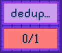

## Deduplication

### Background

This task has the goal of making you a bit more familiar with a important concept in distributed event-driven systems, being duplicated events. 
It is rare that a distributed system can guarantee "once-and-only-once-delivery" of messages.
You have to choose between "at-most-once-delivery" or "at-least-once-delivery", where the later is chosen. 
It is therefore important to build systems that can handle the same message being delivered multiple times.

Interesting article on the problem with [exactly-once-delivery](https://www.confluent.io/blog/exactly-once-semantics-are-possible-heres-how-apache-kafka-does-it/).

### Task

In this task the Quizmaster will send the same question multiple times and it is your task to only answer the question once.

**Example of a question**

```json
{
  "type": "QUESTION",
  "questionId": "41fe30bd-4050-45cb-80b2-cb2e82ec4b84",
  "category": "deduplication",
  "question": "Answer only one question in this category with <You shall not fool me!>",
  "answerFormat": "String"
}
```

**Example answer**

```json
{
  "type": "ANSWER",
  "answerId": "d36b4273-0571-42f2-b3bd-7b7987de43b0",
  "questionId": "41fe30bd-4050-45cb-80b2-cb2e82ec4b84",
  "category": "deduplication",
  "teamName": "l33t team",
  "answer": "You shall not fool me!"
}
```

### If you answer the same question multiple times

Your answer will be displayed as rejected at the leaderboard, which means that your task will ble locked as rejected until you reset it.



To reset the task your team must send the following string as a answer to the task:

`You fooled me :(`

```json
{
  "type": "ANSWER",
  "answerId": "d36b4273-0571-42f2-b3bd-7b7987de43b0",
  "questionId": "41fe30bd-4050-45cb-80b2-cb2e82ec4b84",
  "category": "deduplication",
  "teamName": "l33t team",
  "answer": "You fooled me :("
}
```
